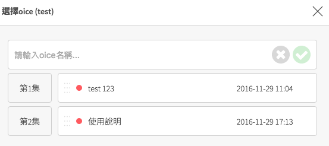
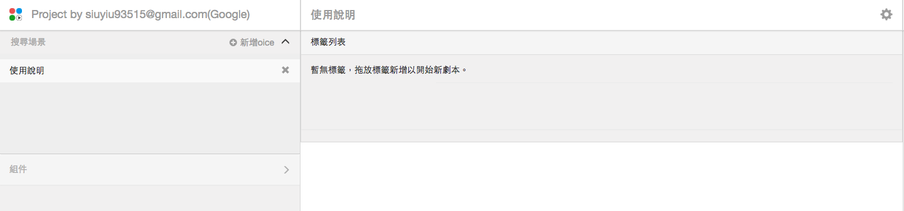
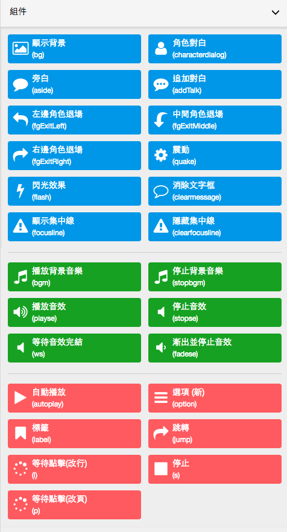
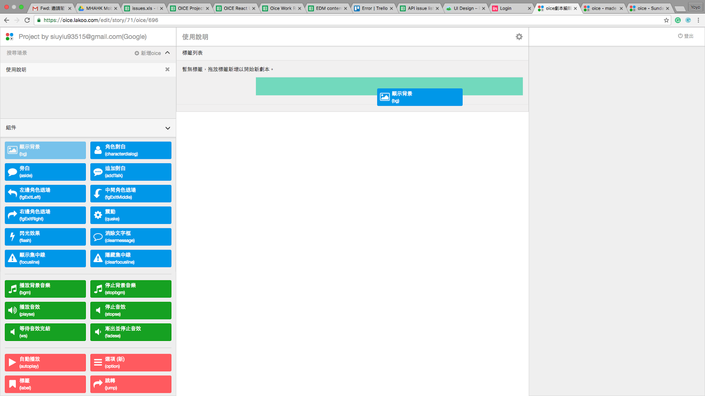
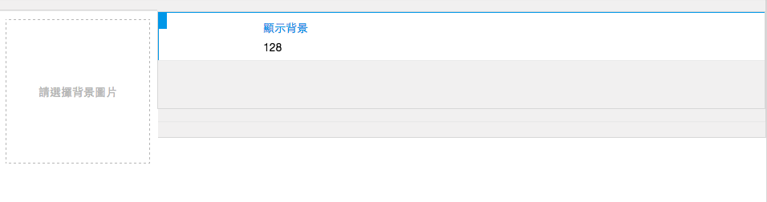
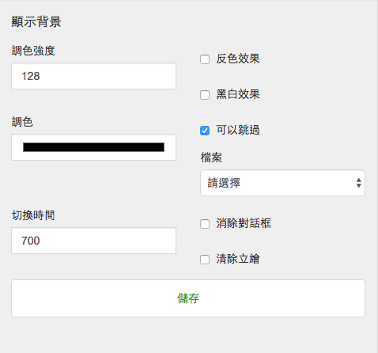
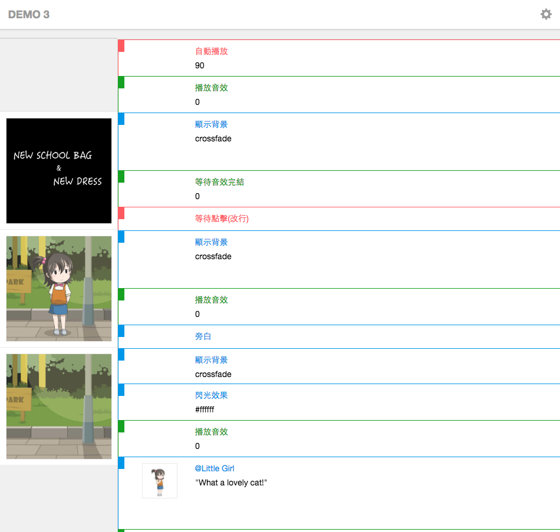
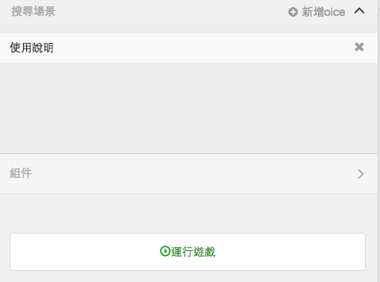

# 使用說明書

## 步驟一
點擊新增oice

為oice命名，并新增。

然後會在oice列單中出現新增的oice。

## 步驟二
點選該oice，右側會出現編輯該oice的標籤列表。

## 步驟三
展開左側的組件，彈出組件列表。

將想要使用的組件拖至中間的標籤列表。
例如，我將要製作的場景第一幕會出現一個背景，則將顯示背景組件!

拖至標籤列表第一行，然後放手。

放手後，該組件就會顯示於列表第一行。

## 步驟四
點擊該組件，右側顯示設定欄，可設定該組件內容。
例如，設定背景圖片。

完成該組件設定後，按下儲存。然後即可在標籤列表中加入另一組件，以完成整個故事的設定。

## 步驟五
設定好故事組件後，點擊運行遊戲以播放故事。

## 步驟六
點擊鏈接即可播放。

